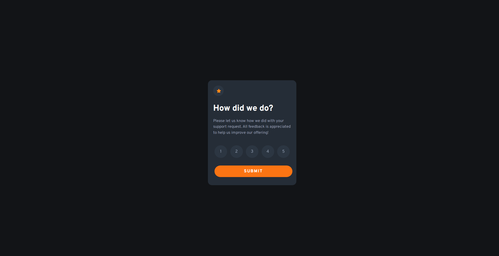
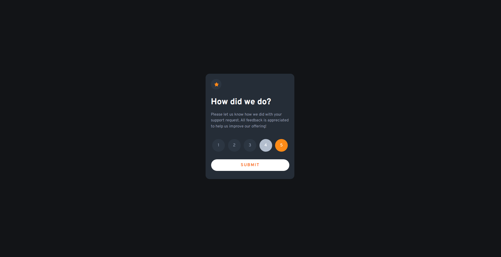
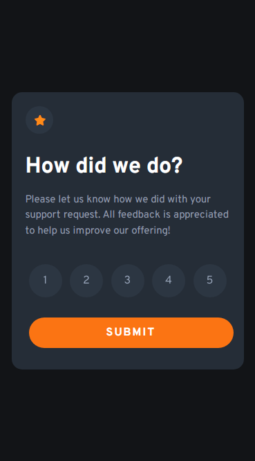
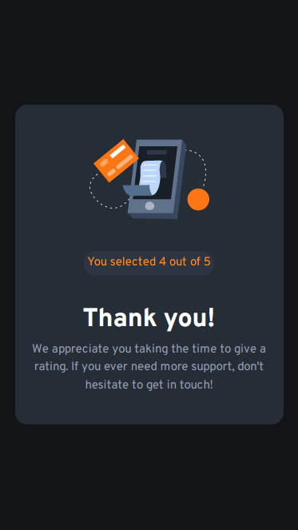

## Table of contents

- [Overview](#overview)
  - [Screenshot](#screenshot)
  - [Links](#links)
- [My process](#my-process)
  - [Built with](#built-with)
- [Author](#author)

## Overview
This is a solution to the [QR code component challenge on Frontend Mentor](https://www.frontendmentor.io/challenges/qr-code-component-iux_sIO_H). Frontend Mentor challenges help you improve your coding skills by building realistic projects. 

### Screenshot

### Links
- Solution URL: [Add solution URL here]https://github.com/Camilaic96/Camilaic96/Challenges-Frontend-Mentor-Interactive-Rating)
- Live Site URL: [Add live site URL here](https://camilaic96.github.io/Challenges-Frontend-Mentor-Interactive-Rating/)

## My process
First, I initialized my project as a public repository on GitHub.
Then I looked at the designs to start planning how to approach the project.
I added Bootstrap and structured the project content in HTML.
I added styles with CSS and Bootstrap considering the challenge specifications.
Once it was finished, I uploaded it to the previously linked GitHub repository.
Finally, I created a JS file to give interactivity to the page.

### Built with
- Semantic HTML5 markup
- CSS custom properties
- Mobile-first workflow
- [Bootstrap](https://getbootstrap.com/) - Frontend framework
- Javascript

## Author
- Website - [Camila Cuello](https://github.com/Camilaic96)
- Frontend Mentor - [@Camilaic96](https://www.frontendmentor.io/profile/Camilaic96)